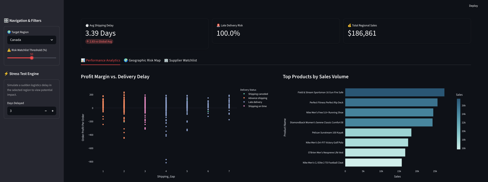

# 🚢 ChainSyn: Supply Chain Command Center

[![LIVE DASHBOARD][(https://static.streamlit.io/badges/streamlit_badge_black_white.svg)(https://chainsyn.streamlit.app/)]

## 📌 Executive Summary
This project is an end-to-end data analytics and simulation dashboard designed to monitor global delivery health, identify high-risk suppliers, and simulate the financial impact of logistics disruptions. Built using Python and Streamlit, this tool transforms 180,000+ rows of raw shipping data into an interactive, enterprise-grade application.

## 🛠️ Tech Stack
* **Data Engineering & Analysis:** Python (Pandas, NumPy)
* **Interactive Visualizations:** Plotly Express
* **Front-End Framework:** Streamlit
* **Environment:** Local Virtual Environment (`.venv`)

## 🚀 Key Features & Business Logic
1. **Dynamic KPI Tracking:** Calculates the **Shipping Gap** (Real vs. Scheduled days) and **Late Delivery Risk** percentages across all global regions.
2. **Stress Test Simulator:** A localized disruption engine that allows managers to artificially inject delayed shipping days into a specific region and watch the downstream impact on operational failure rates in real-time.
3. **Geographic Risk Mapping:** Interactive heatmaps pinpointing specific order cities with the highest concentration of delayed shipments.
4. **Supplier Watchlist:** An automated, threshold-based table identifying specific product categories that fall below acceptable delivery standards, allowing for targeted contract renegotiations.

## 📸 Dashboard Preview


## 💻 How to Run Locally

1. **Clone the repository:**
   ```bash
   git clone [https://github.com/YourUsername/Supply_Chain_Analytics.git](https://github.com/YourUsername/Supply_Chain_Analytics.git)
   cd Supply_Chain_Analytics
